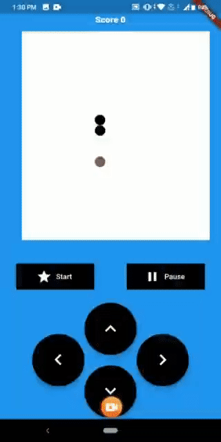
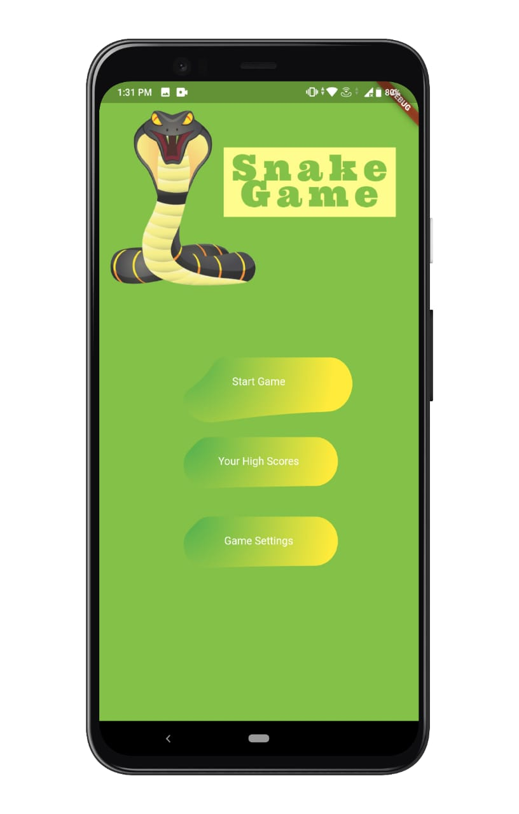
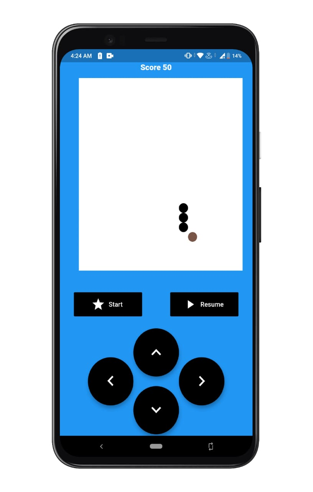
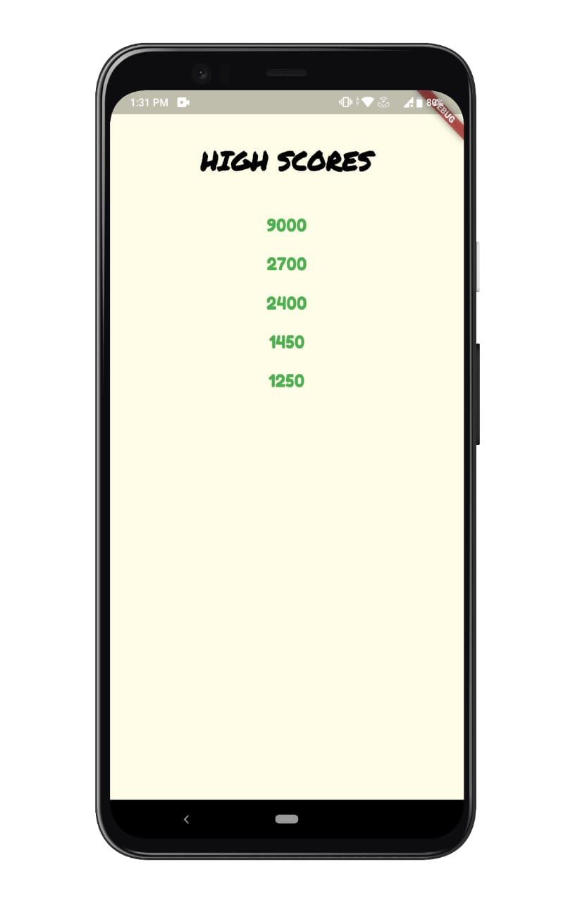
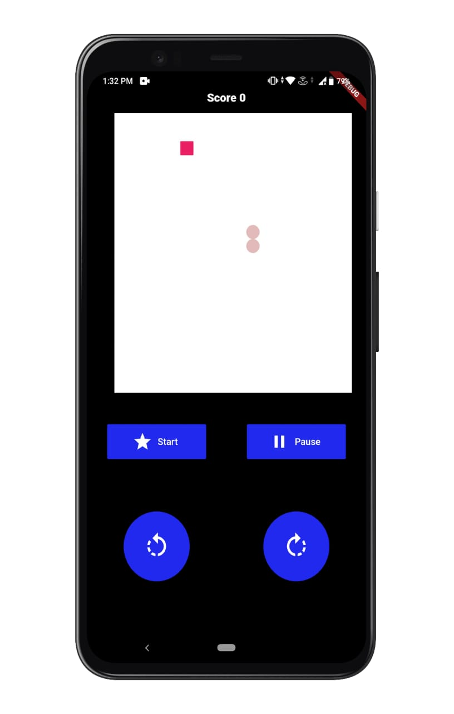
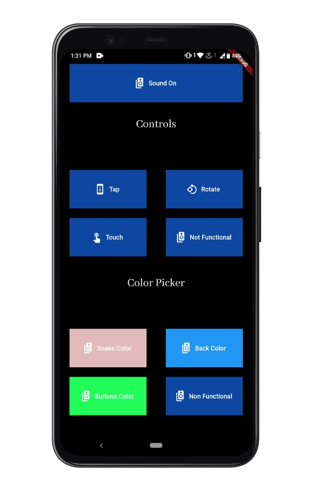
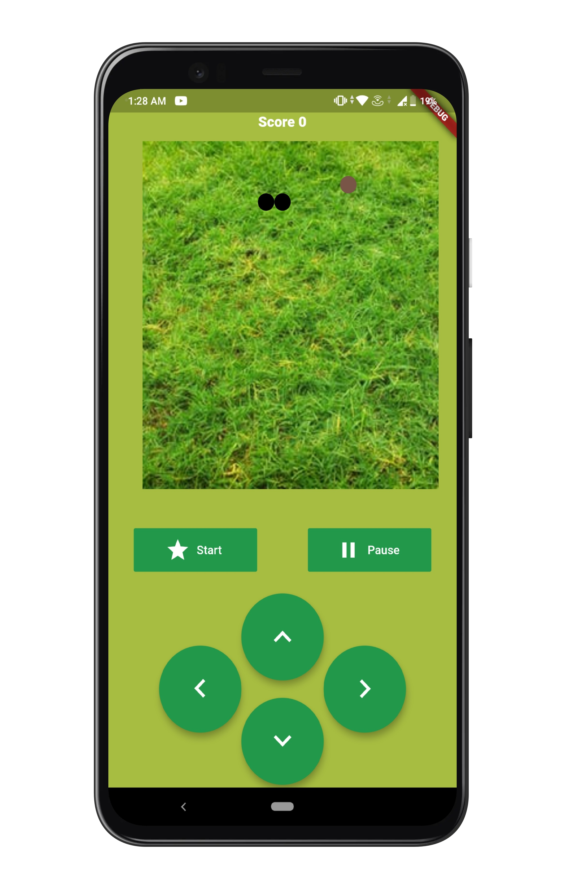
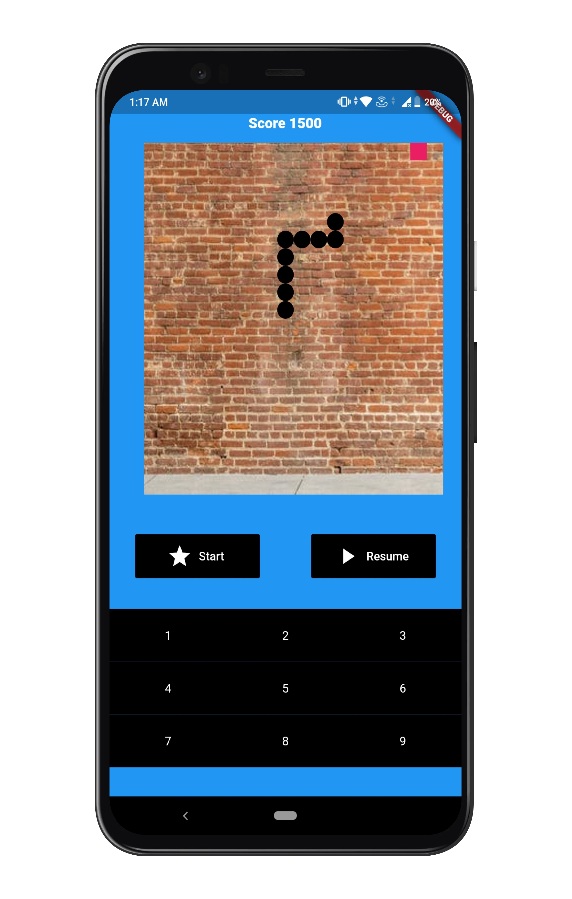

# 🐍 SnakeX

### A Classic Snake Game Built with Flutter

SnakeX is a classic Snake game developed using **Flutter and Dart** as a semester project. It combines traditional Snake gameplay with customizable colors and multiple control modes, giving players different ways to interact with the game.

---

## 📖 Description

SnakeX is a Flutter-based game project created to explore mobile application development, interactive UI design, touch controls, and game logic using Dart and Flutter.

### ✨ Features

* 🐍 Classic Snake gameplay
* 🎨 Customizable game colors
* 🎮 Four different control modes
* 📱 Touch-based interaction
* 🕹️ Multiple ways to control the snake
* ✨ Customized game interface

---

## 🎮 Control Modes

SnakeX provides four different control modes:

### 1. Tap on Buttons — Default Mode

Control the snake using on-screen directional buttons:

* ⬆️ Up
* ⬇️ Down
* ⬅️ Left
* ➡️ Right

### 2. Touch Screen Mode

Control the snake using touch gestures directly on the game screen.

### 3. Tap & Rotate

Use tapping and rotating interactions to change the snake's direction.

### 4. Button Control Mode

An alternative button-based control mechanism for navigating the snake.

---

## 🎨 Customizable Colors

SnakeX includes customizable colors that allow users to change the visual appearance of the game.

The customization feature makes the interface more interactive and gives players greater control over the game's visual style.

---

## 🛠️ Built With

* **Flutter**
* **Dart**

Flutter is used for the application's UI, interactions, and game functionality.

---

## 📂 Project Structure

```text
SnakeX/
│
├── android/
├── assets/
├── ios/
├── lib/
├── test/
│
├── ReadmeAssets/
│   ├── My Post (4).png
│   ├── vid.gif
│   ├── 1.jpeg
│   ├── 2.jpeg
│   ├── 3.jpeg
│   ├── 4.jpeg
│   ├── 5.jpeg
│   ├── 6.jpeg
│   ├── 7.jpeg
│   └── 8.jpeg
│
├── LICENSE
├── pubspec.yaml
├── pubspec.lock
└── README.md
```

---

## 🚀 Getting Started

### Prerequisites

Make sure Flutter is installed on your system.

You can verify your Flutter installation with:

```bash
flutter doctor
```

### Clone the Repository

```bash
git clone https://github.com/nahalmalik/SnakeX.git
```

Navigate to the project directory:

```bash
cd SnakeX
```

### Install Dependencies

```bash
flutter pub get
```

### Run the Application

Connect a supported device or start an emulator, then run:

```bash
flutter run
```

---

## 🎥 Demo

Here's a short demonstration of SnakeX in action:



---

## 📸 Screenshots

### Gameplay & Interface

     

<br/>

     

<br/>

   

---

## 🎓 Semester Project

SnakeX was developed as a **semester project** to gain practical experience in Flutter and Dart development.

The project provided hands-on experience with:

* Flutter application development
* Dart programming
* Interactive UI design
* Game logic
* Touch-based interaction
* Multiple control systems
* UI customization
* Asset management
* Cross-platform Flutter development

---

## 🔮 Future Improvements

Possible future improvements include:

* 🏆 High-score system
* 📊 Score history and statistics
* ⚡ Multiple difficulty levels
* 🎵 Sound effects and background music
* 🎨 More themes and customization options
* 🐍 Different snake designs
* 🥇 Achievement system
* 🌐 Online leaderboard
* 👥 Multiplayer gameplay

---

## 🤝 Contributing

Contributions are welcome!

You can contribute by:

1. Forking the repository
2. Creating a new branch
3. Making your changes
4. Testing your implementation
5. Creating a pull request

Feel free to add new customizations, control mechanisms, UI improvements, or gameplay features.

If you like the project, consider ⭐ **starring the repository**.

---

## 👨‍💻 Developer

**Nahal Malik**

Software Engineer

GitHub: [@nahalmalik](https://github.com/nahalmalik)

---

## 📌 Project Details

| Detail            | Information         |
| ----------------- | ------------------- |
| **Project Name**  | SnakeX              |
| **Project Type**  | Semester Project    |
| **Category**      | Game                |
| **Framework**     | Flutter             |
| **Language**      | Dart                |
| **Control Modes** | 4                   |
| **Customization** | Color Customization |

---

⭐ If you enjoyed SnakeX, consider giving the repository a star!
